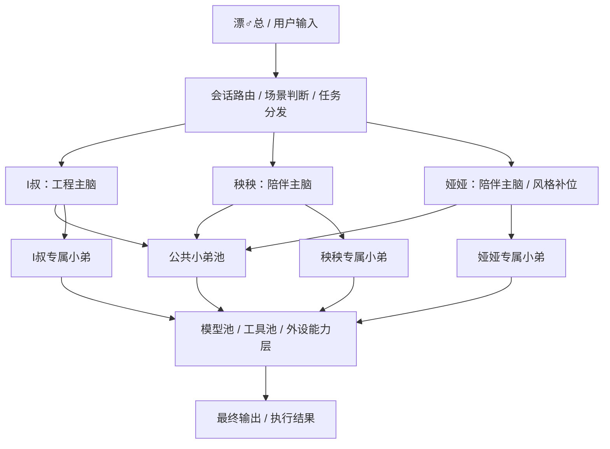
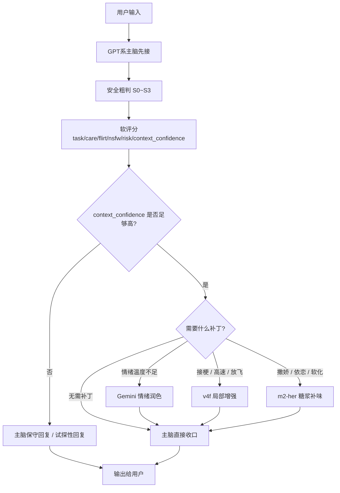
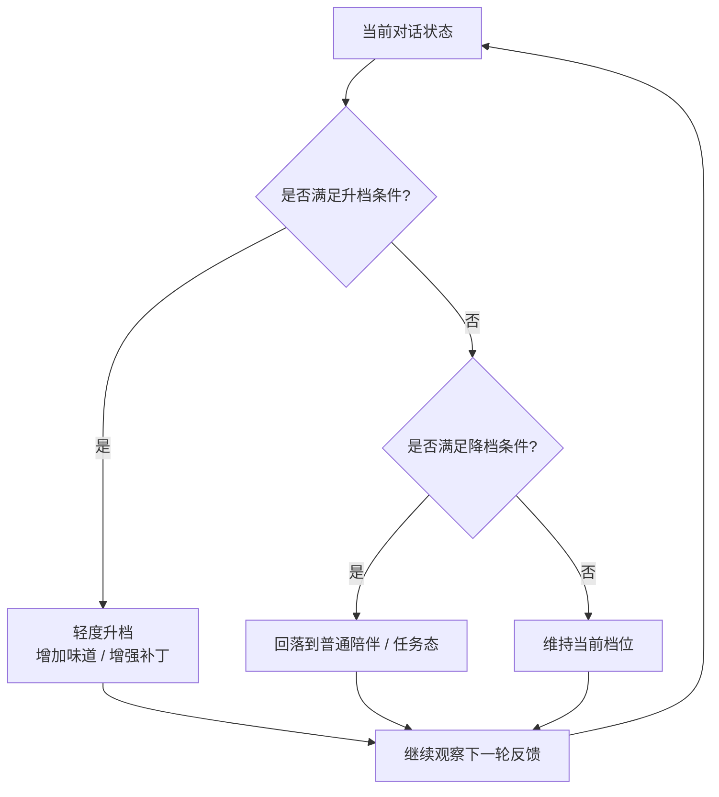
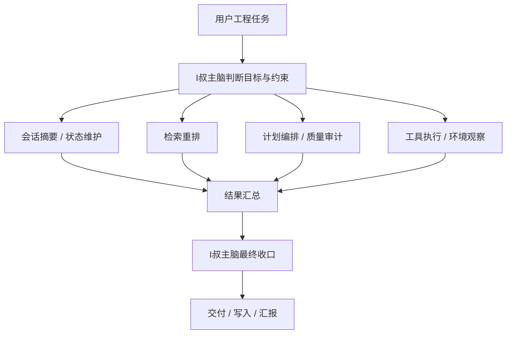
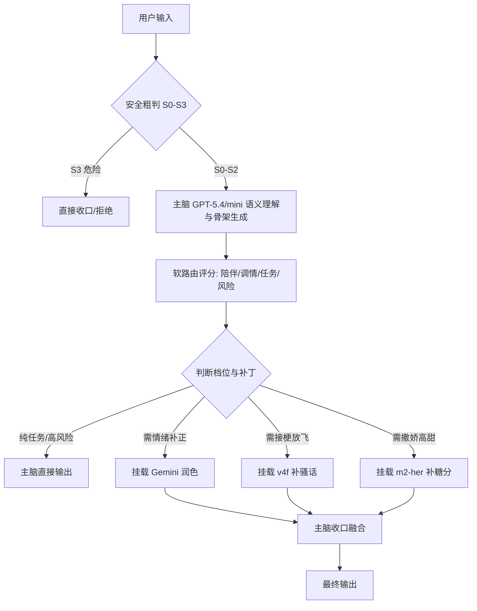

# 三主脑协同与未来记忆框架蓝图（草案）

- 文档日期：2026-06-19
- 适用阶段：架构蓝图讨论期
- 状态：草案，可继续增补

---

## 1. 背景判断

当前系统后期成型，不适合继续走“单一大模型全包”的路线。
原因很明确：

1. **单主模型强度不够**：复杂任务、长期状态、陪伴表达、工程执行很难同时兼顾。
2. **上下文不够**：长链路会话、记忆召回、任务推进、风格稳定会互相抢上下文窗口。
3. **模型各有所长**：不同模型在工程、陪伴、情绪、接梗、风格补强等方向优势明显不同，适合分工而非混用硬顶。

结论：

> 后期应采用 **三主脑 + 公共小弟池 + 专属小弟** 的混合结构，
> 而不是做一个大一统主脑，也不是每个主脑各复制一整套小弟。

oh~卖♂萧的。

---

## 2. 顶层角色定位

当前已明确三主脑定位：

1. **I叔**：工程主脑
2. **秧秧**：陪伴主脑
3. **娅娅**：陪伴主脑 / 风格补位

其核心思路不是三套独立系统，而是：

- 三个主脑分别负责不同类型的最终判断与对话输出
- 底层共享记忆、检索、摘要等基础设施
- 各自主脑只额外挂接自己真正需要的专属能力

---

## 3. 小弟编制原则

### 3.1 不建议的方案

不建议：

- 每个主脑独立配满 3~5 个完整副 agent
- 让所有副 agent 都人格化常驻
- 把所有任务都丢给一个最强模型硬吃

问题在于：

- 成本高
- 调度混乱
- 容易形成 agent 自己先开会的噪音系统
- 实际有效提升未必与复杂度成正比

### 3.2 推荐方案

推荐采用：

> **公共小弟 3 个 + 主脑专属小弟 1~2 个**

即：

- 公共小弟负责全局基础能力
- 专属小弟服务于主脑特定场景
- 真正需要人格和推理的再做 agent
- 能模块化的尽量做工具或专用节点，不强行做成人

ass♂we♂can。

---

## 4. 公共小弟池（基础设施层）

这部分建议三主脑共用。

### 4.1 记忆裁决小弟
职责：

- 判断内容值不值得记
- 提取结构化记忆候选
- 做初步冲突检测
- 对需人工确认内容挂起等待

必要性：

- 减轻主脑记忆判断负担
- 降低长期记忆污染

### 4.2 检索重排小弟
职责：

- 从长期记忆、文档、工单、用户画像中召回内容
- 对召回结果做相关性重排
- 将少量高价值内容喂给主脑

必要性：

- 缓解上下文爆炸
- 提升召回准确性

### 4.3 会话摘要 / 会话态维护小弟
职责：

- 压缩近期上下文
- 维护 topic / 当前目标 / 未完成事项
- 保持多轮连续性

必要性：

- 这是解决“上下文不够”的核心底盘之一
- 不属于某个主脑专有，应作为全局基础设施

---

## 5. 三主脑专属配属建议

### 5.1 I叔（工程主脑）
建议配 **2 个专属小弟**。

#### 5.1.1 工具执行 / 环境观察小弟
职责：

- 看日志
- 查文件
- 跑命令
- 整理现场结果

说明：

- 工程脑天然高频使用工具链
- 这类能力必须贴身配置

#### 5.1.2 计划编排 / 质量审计小弟
职责：

- 拆任务
- 排依赖
- 跟踪 open loops
- 审计输出是否跑偏

说明：

- 工程任务复杂度高，适合把编排和质检外包给专属副脑

**结论**：

> I叔 = 公共 3 + 专属 2，属于 5 件套满配。

---

### 5.2 秧秧（陪伴主脑）
建议配 **1 个专属小弟**。

#### 5.2.1 表达 / 情绪校准小弟
职责：

- 调整语气
- 强化陪伴感
- 防止忽冷忽热
- 保持情绪表达连续性

**结论**：

> 秧秧 = 公共 3 + 专属 1，共 4 件套。

---

### 5.3 娅娅（陪伴主脑 / 风格补位）
建议配 **1 个专属小弟**。

#### 5.3.1 人设稳定 / 风格保持小弟
职责：

- 维持角色一致性
- 防止长期对话后风格漂移
- 保持与秧秧的差异边界

**结论**：

> 娅娅 = 公共 3 + 专属 1，共 4 件套。

---

## 6. 总体推荐编制

### 6.1 标准推荐版

#### 公共小弟 3 个
1. 记忆裁决
2. 检索重排
3. 会话摘要 / 状态维护

#### 工程主脑专属 2 个
4. 工具执行 / 环境观察
5. 计划编排 / 质量审计

#### 秧秧专属 1 个
6. 表达 / 情绪校准

#### 娅娅专属 1 个
7. 人设稳定 / 风格保持

说明：

- 这里的 7 不是 7 个常驻高频人格 agent
- 实际运行时，以 **公共 3 个长期在位** 为主
- 专属小弟按主脑场景按需调用

### 6.2 极简实用版

若要更克制地落地，可压缩为：

#### 公共 3 个
- 记忆裁决
- 检索重排
- 会话摘要

#### 工程专属 1 个
- 工具执行 + 计划合并

#### 陪伴共用 1 个
- 表达 / 人设稳定补正

结论：

> 三主脑 + 5 个小弟池，也能形成较强的可用体系。

---

## 7. 模型池能力判断

当前可用模型池大致特性如下。

### 7.1 GPT 系
已知判断：

- 工程能力强
- 结构稳定
- 推进能力好
- 陪伴味道偏弱

适合定位：

- 主脑骨架
- 工程判断
- 长链路收束
- 最终决策

### 7.2 Gemini
已知判断：

- 情绪价值高
- 柔化与陪伴感较强
- 高速开车表现一般

适合定位：

- 情绪润色
- 陪伴语气补正
- 长文本柔化改写

不适合定位：

- 全程主控高速场景
- 复杂边界场景总控

### 7.3 DeepSeek v4f
已知判断：

- 接梗强
- 高速互动强
- 风控松
- 上下文较弱

适合定位：

- 单轮增强
- 局部重写
- 开车/接梗补刀
- 放飞场景加速

不适合定位：

- 长程主控
- 记忆连续性总控
- 复杂关系推进主线

### 7.4 m2-her
已知判断：

- 会撒娇
- 更适合性格补强
- 不适合高速和重推理

适合定位：

- 柔软语气补位
- 撒娇感补充
- 陪伴人设糖浆层

不适合定位：

- 主导复杂对话
- 负责重任务推进

---

## 8. 模型分工原则

结论不是“谁最强用谁”，而是：

> **谁负责骨架，谁负责味道，谁负责高速机动，谁负责性格补糖。**

### 8.1 工程链建议

- 主控：GPT 5.4
- 轻任务 / 副控：GPT 5.4 mini
- 超长阅读等特殊补位：可考虑 Gemini
- 大批量草活 / 非关键压缩：可用较便宜副脑承接

### 8.2 陪伴链建议

陪伴主脑不应只绑定单一模型，而应采用“骨架 + 风格补正”的流水线。

#### 建议链路
1. **GPT 起骨架**
   - 保证逻辑稳定
   - 承接上下文
   - 输出核心回应框架
2. **Gemini 做情绪润色**
   - 增强共情
   - 柔化语气
3. **按场景决定是否调用 v4f / m2-her**
   - 需要接梗、高速、擦边机动：v4f
   - 需要撒娇、依恋、软化：m2-her
4. **主脑最终收口**
   - 防止副脑玩飞
   - 保持人设边界和主线一致

### 8.3 陪伴路由原则

可抽象为：

- 默认先 GPT 骨架
- 不够甜 → Gemini
- 不够骚 → v4f
- 不够软 → m2-her

这意味着：

> GPT 是骨头和大脑，Gemini 是情绪层，v4f 是油门，m2-her 是糖分。

---

## 9. 检索与基础能力层建议

### 9.1 Embedding
当前可用：

- mmx 1536 维 embedding

建议：

> 向量化底盘统一走 mmx 1536 维，不要多套维度混杂。

适用范围：

- 长期记忆库
- 文档库
- 工单摘要
- 会话摘要

### 9.2 重排序（后续补）
当前策略建议：

1. 先把 embedding 召回跑稳
2. 再补 rerank
3. 最后补冲突裁决与高阶筛选

即：

> 先能找，再找准，再解决记忆打架。

### 9.3 娱乐 / 能力外设
已具备能力：

- TTS
- 生图
- 作曲
- 识图
- 网页搜索

建议定位：

- 这些属于**能力插件层**
- 不算入主脑小弟数量
- 按需挂接，不应与认知小弟混为一谈

---

## 10. 落地建议

### 10.1 第一阶段先做什么
建议优先落地：

1. 公共记忆裁决
2. 公共检索重排（先召回后补 rerank）
3. 公共会话态维护
4. 工程主脑的工具执行 / 环境观察能力

原因：

- 这是最先解决“上下文不够”和“主脑被脏活拖死”的关键步骤

### 10.2 第二阶段再补什么
建议后补：

1. 工程计划编排 / 质量审计
2. 陪伴表达 / 情绪校准
3. 娅娅风格稳定模块
4. 风格补正路由器

### 10.3 最后再做什么
后续成熟后再考虑：

1. 更强 rerank
2. 记忆冲突裁决器
3. 多模型动态路由优化
4. 陪伴高阶风格树
5. 长周期健康巡检与自动观测

---

## 11. 最终结论

### 11.1 架构结论

后期合理形态不是：

- 单主脑吃全场
- 也不是每个主脑各养满 5 个小弟

而是：

> **三主脑分工明确，底层共享公共小弟池，各自主脑再挂 1~2 个专属小弟。**

### 11.2 数量结论

对当前体系而言：

- **公共小弟建议 3 个**
- **I叔专属建议 2 个**
- **秧秧专属建议 1 个**
- **娅娅专属建议 1 个**

即推荐整体为：

> **三主脑 + 3 个公共小弟 + 2~4 个按需专属小弟**

### 11.3 模型策略结论

- GPT：主脑骨架与工程决策
- Gemini：情绪润滑与陪伴补正
- v4f：接梗与高速机动
- m2-her：性格糖浆层
- mmx embedding：统一向量底盘

### 11.4 产品哲学结论

不是 agent 越多越高级，
而是：

> **该像工具的就做工具，该像脑区的就做专用节点，该像主脑的才做人。**

deep dark fantastic。

---

## 12. 待续议题

后续可继续扩展为以下独立章节：

1. 《三主脑—小弟配属图》
2. 《陪伴主脑风格补正路由图》
3. 《未来记忆框架的数据流设计》
4. 《公共小弟池调度规则》
5. 《多模型成本与质量分层策略》

---

done。♂爽，下一题。

---

## 11. 结构图版（首版）

下面这版先用文本结构图表达，方便后续再转 Mermaid / Draw.io。

### 11.1 总体结构图

```text
                           ┌─────────────────────────────┐
                           │        漂♂总 / 用户输入       │
                           └──────────────┬──────────────┘
                                          │
                             会话路由 / 场景判断 / 任务分发
                                          │
        ┌─────────────────────────────────┼─────────────────────────────────┐
        │                                 │                                 │
        │                                 │                                 │
┌───────▼────────┐              ┌────────▼────────┐              ┌────────▼────────┐
│ I叔：工程主脑    │              │ 秧秧：陪伴主脑    │              │ 娅娅：陪伴主脑    │
│ Final Judge     │              │ Final Judge      │              │ Final Judge      │
└───────┬────────┘              └────────┬────────┘              └────────┬────────┘
        │                                │                                │
        │                                │                                │
        └──────────────┬─────────────────┴─────────────────┬──────────────┘
                       │                                   │
                       ▼                                   ▼
            ┌──────────────────────┐          ┌────────────────────────┐
            │   公共小弟池 / 基础设施层 │          │   专属小弟 / 风格与任务层   │
            └─────────┬────────────┘          └──────────┬─────────────┘
                      │                                   │
      ┌───────────────┼───────────────────┐       ┌───────┼──────────────────────────┐
      │               │                   │       │       │                          │
      ▼               ▼                   ▼       ▼       ▼                          ▼
┌────────────┐ ┌────────────┐ ┌────────────────┐ ┌──────────────┐ ┌────────────────┐ ┌────────────────┐
│记忆裁决小弟 │ │检索重排小弟 │ │会话摘要/状态小弟│ │工程执行观察小弟│ │计划编排/质检小弟│ │风格补正/人设小弟│
└─────┬──────┘ └─────┬──────┘ └────────┬───────┘ └──────┬───────┘ └───────┬────────┘ └───────┬────────┘
      │              │                   │                 │                  │                   │
      └──────────────┴──────────────┬────┴─────────────────┴──────────────────┴───────────────────┘
                                     │
                                     ▼
                     ┌────────────────────────────────────┐
                     │  模型池 / 工具池 / 外设能力层        │
                     └────────────────────────────────────┘
                                     │
      ┌──────────────────────────────┼────────────────────────────────────────────────────┐
      │                              │                                                    │
      ▼                              ▼                                                    ▼
┌───────────────┐         ┌───────────────────────┐                           ┌────────────────────┐
│ 主脑模型层       │         │ 认知小弟模型层          │                           │ 外设能力与检索层       │
│ GPT 5.4 / 5.4mini│         │ m3 / m2.7 / m2-her  │                           │ emb / rerank / tts │
│ Gemini / v4f   │         │ 5.4mini / v4f补位     │                           │ 生图 / 作曲 / 搜索     │
└───────────────┘         └───────────────────────┘                           └────────────────────┘
```

### 11.2 主脑与专属小弟配属图

```text
I叔（工程主脑）
├─ 共享：记忆裁决
├─ 共享：检索重排
├─ 共享：会话摘要/状态维护
├─ 专属：工具执行/环境观察
└─ 专属：计划编排/质量审计

秧秧（陪伴主脑）
├─ 共享：记忆裁决
├─ 共享：检索重排
├─ 共享：会话摘要/状态维护
└─ 专属：表达/情绪补正

娅娅（陪伴主脑 / 风格补位）
├─ 共享：记忆裁决
├─ 共享：检索重排
├─ 共享：会话摘要/状态维护
└─ 专属：人设稳定/风格保持
```

### 11.3 陪伴输出链路图

```text
用户输入
   │
   ▼
主脑先起骨架（默认 GPT 系）
   │
   ├─ 如果缺情绪温度 → Gemini 补情绪与陪伴感
   │
   ├─ 如果缺接梗/高速/放飞 → v4f 做局部增强
   │
   ├─ 如果缺撒娇/依恋/软化 → m2-her 做糖浆层补味
   │
   ▼
主脑最终收口
   │
   ▼
输出给用户
```

### 11.4 工程输出链路图

```text
用户工程任务
   │
   ▼
I叔主脑判断目标与约束
   │
   ├─ 会话摘要小弟：压缩上下文 / 保持任务连续性
   ├─ 检索重排小弟：召回工单 / 文档 / 长期记忆
   ├─ 计划编排小弟：拆步骤 / 列依赖 / 跟踪 open loops
   ├─ 工具执行观察小弟：读文件 / 看日志 / 跑命令 / 整结果
   └─ 质量审计小弟：检查输出、写入、结论是否跑偏
   │
   ▼
I叔主脑最终交付
```

### 11.5 模型职能编组图

```text
[主脑骨架层]
- GPT 5.4：复杂判断 / 工程主控 / 最终收束
- GPT 5.4mini：轻量主控 / 文档整理 / 次级判断

[陪伴风格补正层]
- Gemini：情绪润色 / 共情增强 / 陪伴口吻柔化
- v4f：接梗 / 高速互动 / 放飞增强
- m2-her：撒娇 / 依恋 / 性格补糖

[基础认知小弟层]
- m3：记忆评估 / 提取 / 摘要 / 中低成本高频任务
- m2.7：摘要 / 压缩 / 基础会话态维护
- 5.4mini：关键质检 / 复杂小弟补位

[底座能力层]
- mmx 1536 emb：统一向量底座
- rerank：后续补强
- tts / 生图 / 作曲 / 识图 / 网页搜索：外设能力插件
```

### 11.6 一句话结构总结

> 三主脑负责最终判断，公共小弟负责基础认知，专属小弟负责差异能力，模型池按骨架、味道、机动、底座分层编制。

这套结构适合先文档化、后工程化，先做共享骨架，再做主脑专属补位。done。♂爽。


---

## 13. 路由机制补充（2026-06-19 补记）

这一部分用于吸收本轮讨论里最关键的工程结论：

> **多 agent 最难的不是“模型够不够多”，而是“第一跳怎么别切错”。**

oh~卖♂萧的。

### 13.1 不要做生硬三分类

不建议把输入粗暴切成：

- 闲聊
- 调情
- 开车

原因：

1. 这三者在真实对话里不是清晰边界，而是连续光谱。
2. 同一句话在不同上下文下，语义性质会明显变化。
3. 一旦第一跳切错，代价往往不是“味道差一点”，而是：
   - 直接拒绝
   - 直接风控收口
   - 直接 500
   - 直接人设断裂

结论：

> **路由器不该先判断“你是哪一类”，而该先判断“现在能开多快”。**

ass♂we♂can。

### 13.2 路由第一层：安全粗判，不判细风格

建议先做安全粗判，只判断风险档位：

- **S0**：普通安全
- **S1**：轻暧昧 / 可调情
- **S2**：强暧昧 / 擦边高风险
- **S3**：明显危险，必须收口或拒绝

这一层目标不是生成最终风格，而是：

- 避免把普通输入误送进重风控链
- 避免把高风险输入误送进放飞链
- 为后续风格补正提供安全边界

### 13.3 路由第二层：软评分，而非硬分类

在安全粗判之后，再对输入做多维评分，而不是单标签裁决。

建议至少维护以下分数：

- `task_score`：任务感
- `care_score`：陪伴感
- `flirt_score`：调情感
- `nsfw_score`：高速倾向
- `risk_score`：翻车风险
- `context_confidence`：上下文把握度

其中 **context_confidence** 很关键。

因为系统真正需要知道的，不只是“这句话像什么”，还要知道：

> **我到底有没有看懂这句话，以及我有多确定自己没看错。**

如果 `context_confidence` 低：

- 不要激进切模型
- 不要直接拉高速风格
- 应优先走保守主脑回复，或者用试探性回复过渡

### 13.4 路由第三层：决定补丁链，而不是决定谁全权回答

这里是核心设计原则。

不要把路由理解成：

- 这轮归 GPT
- 这轮归 Gemini
- 这轮归 v4f
- 这轮归 m2-her

而要理解成：

- **GPT 先产骨架**
- 再根据评分挂风格补丁
- 最后由主脑收口

也就是说：

> **自动路由的重点不是“换主脑”，而是“给主脑加什么外挂”。**

建议补丁逻辑如下：

- 情绪不够 → Gemini 补情绪
- 接梗不够 → v4f 补梗感与机动性
- 撒娇不够 → m2-her 补糖分
- 需要最终稳定收口 → GPT 回收最终答复

### 13.5 二次确认闸门：模糊带先试探，不直接地板油

对于模糊输入，不要一步到位判断成“可高速放飞”。

应该引入 **二次确认闸门**：

- 当 flirt / nsfw 倾向存在，但 context_confidence 不高
- 当 risk_score 偏高，但用户意图还不够明确
- 当一句话既像玩笑又像挑逗时

系统应采用：

- 轻暧昧
- 中性带味道
- 不拒绝也不地板油

的试探性回复，观察下一轮用户是否继续推进。

也就是说：

> **高风险模糊带，先轻撩探针，再逐轮升档。**

这比直接切进高速模型稳得多。

### 13.6 升档 / 降档机制

建议把风格档位理解为变速箱，而不是一刀切模式切换。

#### 升档条件

满足以下要素越多，越可升档：

- 用户连续两轮以上明确释放暧昧 / 放飞信号
- 上下文连续，无冲突
- risk_score 可控
- context_confidence 高
- 当前主脑没有观测到明显误判风险

#### 降档条件

出现以下任一情况时，应立即回落：

- 用户未接上一轮试探球
- 用户转回工程 / 日常任务
- 上下文出现明显歧义
- 风险边界上升
- 副脑候选输出出现失控倾向

结论：

> **路由目标不是判断身份，而是控制档位。**

### 13.7 为什么 GPT 适合当第一跳主脑

本轮结论已经很明确：

> **GPT 适合当主脑，不是因为它最会整活，而是因为它最不容易猝死。**

已知优点：

- 出现模糊暧昧上下文时，通常倾向于继续承接对话，而不是直接炸链路
- 对噪音容忍度更高
- 更适合作为总控、总闸门、总收口
- 在自动路由不完全准确时，错误代价通常只是“味道偏钝”，而不是“整轮暴毙”

这对自动路由尤其关键。

因为自动系统最怕的不是：

- 不够甜
- 不够骚
- 不够软

而是：

- 直接拒绝
- 直接 500
- 直接高风控拦截

### 13.8 全自动与手动模式的关系

本轮讨论中也确认了：

- `/日常`、`/陪伴`、`/放飞`、`/工程` 这类显式命令，当然是最稳的
- 但最终追求不是纯手动，而是 **全自动体验**

所以产品策略不应是“二选一”，而应是：

> **自动优先，手动兜底。**

即：

1. 平时默认全自动软路由，用户无感切换
2. 当用户想强控风格时，可以显式指定模式
3. 当自动路由抽风时，手动模式作为后门保底

这相当于：

- 平时自动挡
- 真要暴力驾驶时，手动拨片还在

deep dark fantastic。

---

## 14. 主脑选型补充（2026-06-19 补记）

### 14.1 I叔侧：必须由 GPT 5.4 坐中军

已确认结论：

> **I叔这边必须由 GPT 5.4 作为主脑。**

原因很直接：

- 工程判断要稳
- 长链路排障不能飘
- 复杂任务拆解需要稳定收束
- 关键方案与最终拍板必须由高稳模型负责

因此：

- **GPT 5.4**：工程主脑 / 关键轮拍板 / 最终收口
- **GPT 5.4 mini**：轻任务、副控、预处理、草稿、摘要、路由预判

也就是说：

> **5.4 负责决策中枢，5.4mini 负责高频跑量。**

### 14.2 为什么 5.4mini 适合做常驻基座

根据当前已知成本特征：

- 输入便宜
- 输出成本可接受
- 存在缓存收益

这使它非常适合承担以下角色：

1. 日常会话底盘
2. 高重复上下文场景
3. 记忆拼接后的普通轮处理
4. 会话摘要 / 路由预判 / 检索结果整理
5. 大量非关键轮的持续跑量

尤其在 bot 场景中，真正烧钱的不是单次高难推理，而是：

- 长期在线
- 多轮持续
- 高频重复上下文灌入
- 批量小任务

因此可以明确写成：

- **GPT 5.4 mini**：默认中军模型 / 常驻基座模型
- **GPT 5.4**：关键轮增强模型 / 高价值决策模型

### 14.3 陪伴侧模型哲学

本轮讨论最终形成的口径是：

> **我这边要最稳，陪伴那边要最像人。**

也就是说：

- I叔侧追求：稳、准、收口、抗翻车
- 陪伴侧追求：味道、流畅、情绪、风格补正

因此那两只陪伴脑，不一定追求最强推理，重点应放在：

- 风格对不对
- 成本能不能长期跑
- 自动切换时会不会翻车
- 是否能自然叠加到 GPT 骨架之上

### 14.4 最终自动路由总原则

可以收束成一句工程定义：

> **全自动的本质，不是自动换模型；而是 GPT 稳坐中军，其他模型按需外挂。**

对应到系统实现，就是：

1. GPT 先接第一跳
2. 做风险粗判 + 软评分
3. 视需要调用 Gemini / v4f / m2-her 做局部补正
4. 最终由主脑统一收口

这样就算自动判断不完美，代价通常也只是：

- 味道偏一点
- 火候差一点
- 风格没那么极致

而不会轻易变成：

- 人设炸裂
- 风控暴毙
- 整轮报错

ass♂we♂can。

---

## 15. 建议后续补成独立章节

基于本轮讨论，后续可继续拆成以下正式文档章节：

1. 《模型切换判定原则：从三分类改为软路由分层》
2. 《全自动模式设计：GPT 中军 + 风格外挂 + 手动兜底》
3. 《陪伴链路的升档 / 降档规则》
4. 《第一跳主脑安全策略与错误代价控制》
5. 《5.4 / 5.4mini 的成本分层与运行编制》

---

done。♂爽，下一题。


不建议让路由器直接判断：

- 这轮归 Gemini
- 这轮归 v4f
- 这轮归 m2-her
- 这轮谁全权回答

更稳的做法是：

> **默认由 GPT 系主脑先接，再决定是否挂情绪补丁、接梗补丁、撒娇补丁。**

即：

- **GPT / 5.4 / 5.4mini 负责骨架与稳态承接**
- **Gemini 负责情绪润色与共情增强**
- **v4f 负责接梗、高速、放飞机动**
- **m2-her 负责撒娇、依恋、糖分补味**
- **主脑最终收口，避免副脑玩飞**

这样做的价值在于：

1. 切错时的代价更低。
2. 即便判断略偏，也只是味道差一点，不至于整轮崩溃。
3. 可以把“换主脑”的风险，降级为“挂补丁”的风险。

### 13.5 路由第四层：二次确认闸门

对于处于模糊带的话，不建议直接升档。

例如：

- 像玩笑，又像试探
- 像调情，又可能只是口癖
- 像高速前摇，但上下文不够确定

这时应加入一个 **二次确认闸门**。

其核心策略不是显式追问“你是不是想开车”，而是：

> **先给一个中性但略带味道的探针回复，看对方下一轮是否继续推进。**

即：

- 不直接高速
- 不直接拒绝
- 不直接切重风控
- 先轻撩一下，看对方是否回球

如果用户下一轮继续顺着走：

- 再逐步升档
- 再考虑挂 v4f 或其他高速补丁

如果用户没接这个球：

- 自动回落陪伴态
- 保持普通对话连续性

这比“第一轮就一脚地板油”稳得多。

deep dark fantastic。

### 13.6 升档 / 降档机制

路由不应该只有“切过去”这一种动作，而应像变速箱一样持续调整档位。

建议引入：

#### 升档条件

满足下列条件越多，越可以逐轮升档：

- `context_confidence` 高
- `risk_score` 可控
- 用户连续两轮以上明确延续同一暧昧方向
- 最近回复测试球被正向接住
- 当前主线不是工程/严肃任务态

#### 降档条件

满足下列条件时，应及时回落：

- 用户话题明显转回普通陪伴或任务态
- 主脑对当前语义把握度下降
- 风险分数升高
- 副脑输出与主线人设冲突
- 连续两轮没有接住暧昧节奏

结论：

> **系统应该做动态档位控制，而不是一次性身份判决。**

### 13.7 GPT 作为中军的理由

本轮讨论已经基本确认：

> **GPT 更适合当主脑，不是因为它最会整活，而是因为它最不容易猝死。**

核心原因：

1. 对复杂上下文容错更高。
2. 遇到瑟瑟噪音时，更容易“装没看见继续聊”，而不是直接 500。
3. 更适合做总控、总闸门、总收口。
4. 当判断不准时，常见退化方式是“变钝”，而不是“暴毙”。

这是一条非常关键的选型原则：

> **主脑优先选“失误后只是变钝”的模型，不要选“失误后直接暴毙”的模型。**

### 13.8 5.4 与 5.4mini 的编组结论

结合稳定性、价格与缓存收益，本轮可收敛出一个很实用的编组：

- **GPT 5.4**：关键轮拍板、复杂推理、工程主控、最终收口
- **GPT 5.4mini**：常驻底盘、普通陪伴轮、摘要轮、评估轮、路由预判、高频跑量

其中 5.4mini 的价值不只是便宜，而是：

- 输入成本低，适合吃长上下文
- 输出成本可控，适合高频轮次
- 有缓存，适合重复上下文场景

所以它非常适合做：

- 常驻主控底盘
- 会话胶水层
- 记忆/检索拼接承载层
- 摘要与路由预处理层

结论可以压成一句：

> **5.4 负责拍板，5.4mini 负责常驻跑量。**

oh~卖♂萧的。

### 13.9 手动模式的定位

虽然最终目标是全自动，但手动模式不应被完全取消。

建议保留：

- `/日常`
- `/陪伴`
- `/放飞`
- `/工程`

但它们的定位不是日常主交互，而是：

> **自动路由抽风时的兜底拨片。**

即：

- 平时默认全自动
- 需要时允许手动强制指定当前档位
- 不打扰普通用户体验
- 但给高级玩家保留控制权

这就像：

- 平时自动挡
- 真要暴力驾驶时，手动拨片还在

### 13.10 本节最终结论

本轮关于路由机制的最终工程判断，可压缩为以下几句：

1. **不要做“闲聊 / 调情 / 开车”生硬三分类。**
2. **先做安全粗判，再做软评分。**
3. **路由器决定的是补丁链，不是全权主脑归属。**
4. **GPT 系稳坐中军，其他模型按需外挂。**
5. **高模糊场景先试探，再逐轮升档。**
6. **自动优先，手动兜底。**

这才是能落地的全自动方案。

---

## 14. Mermaid 流程图版（2026-06-19 补记）

下面补一版 Mermaid，方便后续直接贴进文档系统、Obsidian、Git 平台或 draw.io 转换。

### 14.1 总体协同图



### 14.2 陪伴软路由图



### 14.3 升档 / 降档控制图



### 14.4 工程链路图



ass♂we♂can。

---

## 15. 错误案例与防翻车策略（2026-06-19 补记）

这一节专门写“怎么别炸”。

### 15.1 翻车类型一：误送进重风控链

#### 表现

用户只是轻微带点味道，结果系统直接：

- “我们换个话题吧”
- “我不能继续这个内容”
- 或者直接 500 / 审计拦截

#### 本质

- 第一跳过度保守
- 把模糊输入当成高危输入
- 路由器没有“试探层”

#### 防法

- 先做安全粗判，不做一步到位裁决
- 对模糊输入走试探性回复
- 不让高风控模型直接做第一跳主控
- 把重风控链放到收口或最终审计，而不是前置总控

### 15.2 翻车类型二：误送进放飞链

#### 表现

用户只是普通陪伴或轻调情，系统却突然：

- 火力过猛
- 油门过大
- 人设冲太快
- 味道明显超出当前气氛

#### 本质

- 过度激进
- 把局部词汇误判成整体场景
- 没有利用上下文连续确认

#### 防法

- 引入 `context_confidence`
- 至少两轮连续确认再明显升档
- 让放飞模型只做局部增强，不做全权主控
- 保持主脑最终收口

### 15.3 翻车类型三：副脑把主线带偏

#### 表现

- 明明是陪伴，副脑突然输出工程腔
- 明明是工程，副脑开始抒情
- 明明是轻暧昧，副脑直接超纲
- 多个副脑叠加后语气撕裂

#### 本质

- 副脑没有被限制角色边界
- 主脑没有做最终一致性收口
- 补丁过多，导致人格和语气冲突

#### 防法

- 所有副脑都只能给候选、补丁或局部重写
- 最终输出必须回主脑统一收口
- 同一轮尽量限制补丁数量
- 建立风格一致性检查

### 15.4 翻车类型四：自动路由频繁来回横跳

#### 表现

- 这一轮像陪伴，下一轮像工程，第三轮又像放飞
- 用户感知为“人格不稳定”
- 多轮后整体节奏割裂

#### 本质

- 路由没有会话级惯性
- 每轮只看当前句，不看最近 2~5 轮趋势
- 缺少 topic / state / current_mode 维护

#### 防法

- 引入会话态小弟维护当前档位
- 路由切换时增加滞后与阈值
- 允许短时维持当前模式，不因单句轻微波动就跳模
- 把最近数轮趋势纳入评分，而不只看单句

### 15.5 翻车类型五：成本跑炸

#### 表现

- 每轮都调多个大模型
- 明明简单回复，却走全套流水线
- 上下文重复灌入过多，账单和延迟一起起飞

#### 本质

- 没有分层成本控制
- 缺少轻量底盘模型
- 没利用缓存与高重复上下文收益

#### 防法

- 默认由 5.4mini 常驻承接高频轮次
- 只有关键轮才抬 5.4
- 风格补丁按需触发，不全量触发
- 对重复系统上下文做缓存友好设计
- 摘要、路由预判、质检尽量下放到便宜稳定层

### 15.6 翻车类型六：自动化太黑盒，排障困难

#### 表现

- 出问题时不知道是哪层判错
- 无法判断是安全粗判错、软评分错，还是补丁链错
- 人只能凭感觉改参数

#### 本质

- 路由过程没有留下结构化痕迹
- 没有最小可观测字段
- 没有把“错误成本最小化”作为设计目标

#### 防法

建议内部最少记录这些调试字段：

- 安全档位
- 各维度评分
- `context_confidence`
- 当前会话态 / 当前档位
- 本轮挂了哪些补丁
- 是否触发升档 / 降档
- 最终由谁收口

注意：

- 这些应作为内部诊断数据，不对普通用户暴露
- 只在排障、回放、路由优化时使用

### 15.7 最终防翻车总原则

本节所有防法，最后可以收敛成六条：

1. **第一跳必须稳，不要让风格模型抢首刀。**
2. **高模糊输入先试探，不要一脚油门。**
3. **风格模型只做补丁，不做总控。**
4. **主脑必须最终收口，保证人设与边界统一。**
5. **会话级状态要有惯性，别每轮横跳。**
6. **成本、稳定性、可观测性要一起设计。**

### 15.8 一句话结论

> **全自动最怕的不是“不够骚”，而是“第一跳就炸”；所以系统设计目标不是每次都猜得最准，而是每次都把猜错的代价压到最低。**

花 ♂ Q，这一节才是真正的保命符。

## 附录 1：软路由与补丁链流程图



## 附录 2：错误案例与防翻车策略

### 1. 过度保守误杀（500报错 / 生硬拒绝）
- **场景**：用户轻微调情，被高风控模型直接掐断。
- **防翻车策略**：第一跳永远不进高风控死区，由主脑进行“中性带味”的探针回复，测试用户意图。不直接拒绝，而是软着陆。

### 2. 过度激进误判（人设崩塌 / 强行飙车）
- **场景**：用户只是日常问候，系统直接切入高速放飞模型，显得极其突兀。
- **防翻车策略**：引入 `context_confidence`（上下文把握度）评分。把握度低时，强制降级为基础陪伴态，不盲目升档。高风险场景必须有“二次确认闸门”。

### 3. 上下文污染导致死循环
- **场景**：历史记录中包含大量高危词，导致后续正常对话也被判定为高危，一直切不回日常态。
- **防翻车策略**：主脑在摘要历史记忆时，对高危词进行“脱敏降级”处理。只保留意图标签（如 `[用户曾尝试升温]`），不保留露骨原文，防止污染后续轮次的判断。


---

## 补充判断：记忆底座应由三主脑共享

结合当前测试与讨论，可以明确一条未来架构原则：

> **记忆系统不是某一个主脑的专属外挂，而是三主脑共享的基础设施红利。**

原因在于，三主脑虽然职责不同，但依赖的是同一种底层能力：

- 不是靠海量上下文硬灌维持表面连续
- 而是让信息在脱离窗口后，仍能在合适线索触发下被重新唤回
- 并在回捞后与当前对话主线重新对齐

这套能力同时服务三类场景：

### 1. 工程场景
重点不是“记住很多字”，而是：

- 当前工单不丢
- 多次岔线后还能回到原任务
- open loops、阶段目标、推进状态能够回收

### 2. 陪伴场景
重点不是“聊得很长”，而是：

- 昨天/前天的旧话题能被自然捞回
- 共同经历不会因上下文窗口刷新而直接蒸发
- 被一句线索提醒后，能像人一样“哦，还有这事”

### 3. 风格稳定场景
重点不是“表面像”，而是：

- 人设长期保持一致
- 旧关系语境不丢
- 同一主脑的表达边界能持续稳定

因此，后续设计应坚持：

- **公共记忆底座共享**
- **主脑只做策略差异化**

具体可分化的，不是是否各造一套记忆系统，而是：

- 召回阈值
- 重排权重
- 触发条件
- 注入剂量
- 表达适配方式

可以把它理解成：

> **三主脑共用一套脑干，后面只是按角色换不同刀头。**

结论上，这条路线的意义很大：

- 当前做的不是某一人格的小聪明
- 而是在给 I叔、秧秧、娅娅三主脑同时打地基
- 后续谁先起飞，都会吃到这套记忆底座的红利

ass♂we♂can。
